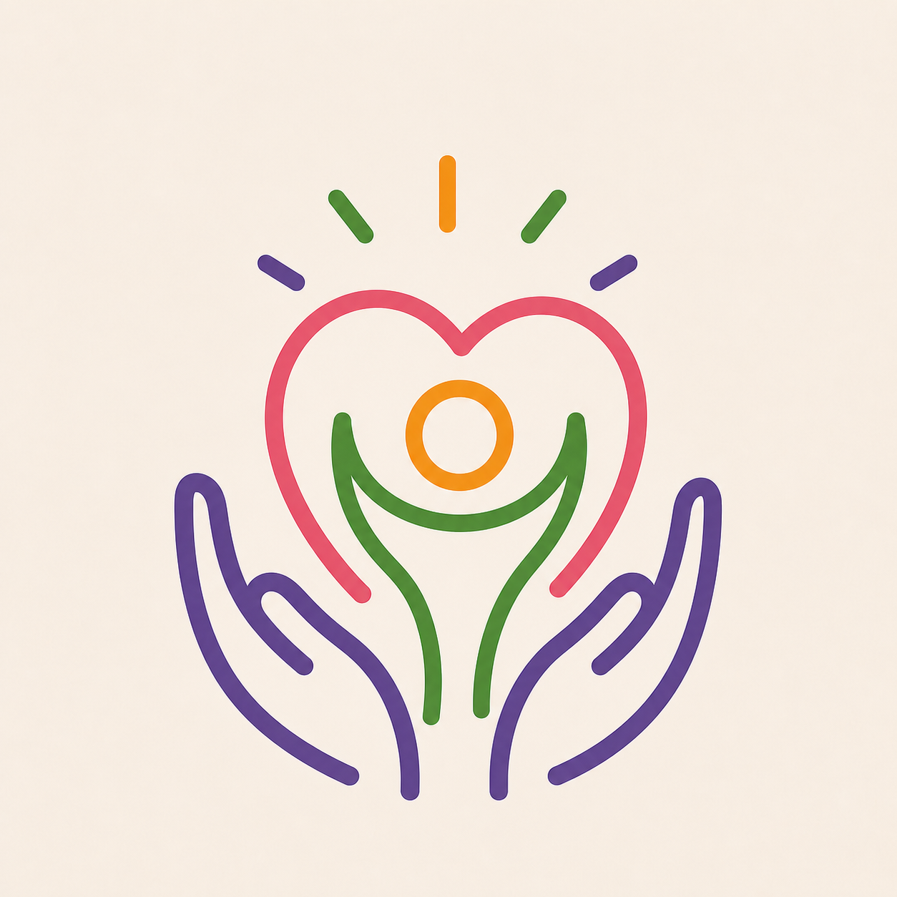

# 🤲 Mann Ka Saathi (Your Mental Wellness Companion)

**Mann Ka Saathi** is an AI-powered, empathetic mental health and wellness platform designed to provide a safe space for users to express their feelings, track their mood, and seek emotional support. Powered by the Google Gemini API, it acts as a bilingual virtual companion (Hindi, English, Hinglish) that listens, understands, and responds with care.

 ## 🚀 Features

- **💬 AI Chatbot (Gemini Powered):** Context-aware, empathetic conversations that remember user preferences and respond in their preferred language.
- **📊 Mood Tracker & Visual Analytics:** Users can track their daily emotional state using intuitive emoji selectors. Interactive graphs (`recharts`) visualize a 7-day mood trend.
- **✨ Daily Affirmations:** Scientifically backed positive quotes that update daily to boost the user's mood.
- **🆘 Emergency Resources:** A dedicated SOS section providing immediate access to professional mental health helplines.
- **📱 PWA (Progressive Web App):** Fully installable on Android, iOS, and Desktop. Works like a native app with a custom icon and splash screen.
- **🎨 Modern UI/UX:** Smooth animations using `Framer Motion`, auto-scrolling chat, and a beautiful, soothing color palette.
- **🔒 Privacy First:** Localized user state management for a seamless and private onboarding experience.

## 🛠️ Tech Stack

- **Frontend:** React.js, Vite
- **Styling & Animations:** Framer Motion (for smooth bubble transitions & typing indicators)
- **Data Visualization:** Recharts
- **AI Integration:** Google Generative AI (Gemini API)
- **PWA Capabilities:** vite-plugin-pwa
- **Deployment:** Vercel

## ⚙️ Installation & Setup (Local Development)

Follow these steps to run the project on your local machine:

1. **Clone the repository:**
   ```bash
   git clone [https://github.com/your-username/mann-ka-saathi.git](https://github.com/your-username/mann-ka-saathi.git)
   cd mann-ka-saathi
